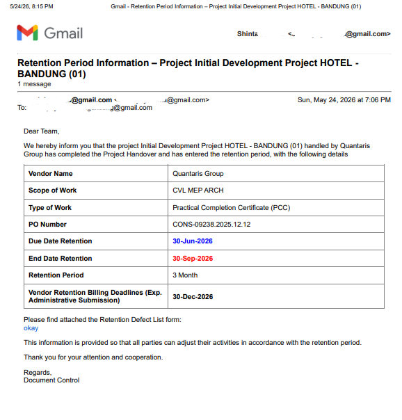

# Automated Project Governance & Retention Notification System

## Overview
An event-driven automation framework engineered within the Google Workspace environment using Google Apps Script and Gmail API. The system monitors database mutations via installable spreadsheet triggers, automatically validating project control parameters, and compiling dynamic HTML corporate alerts for critical vendor retention milestones.

## The Problem
Tracking project retention periods manually in spreadsheets presents severe operational and compliance risks in large-scale civil project execution:
* **Human Error:** Forgetting to review milestone columns leads to missed retention billing periods and administrative friction.
* **Operational Inefficiency:** Manually copy-pasting data array values from sheets into individual emails for third-party contractors consumes hours of document control time.
* **Data Incompleteness:** Sending communication based on partially completed data rows causes misinformation across stakeholders.

## Technical Solution & Architecture
The codebase functions as an automated data validation and communication engine, eliminating manual human intervention post-data entry.

* **Installable Event-Trigger Architecture:** Deployed via an installable `From spreadsheet - On edit` trigger. The engine optimizes execution quotas by checking changes globally, immediately returning early if edits occur outside of the operational boundary (**Column M / Due Date Retention**).
* **Automated Data Integrity Mapping:** Implements a strict validation loop using a predefined index coordinate matrix (`mandatoryIndexes`). If any foundational data component (Vendor, PO, Scope, or Recipient) is missing or corrupted, execution is safely halted.
* **Type-Safe Date Engine:** Evaluates spreadsheet objects explicitly to verify `Date` type inheritances (`instanceof Date`) for the retention boundaries, computing exact contractual deadlines (e.g., *Due Date + 6 Months*) programmatically.
* **Dynamic HTML Rendering & Delivery:** Parses spreadsheet string arrays into clean, inline-styled corporate HTML tables, explicitly highlighting deadline properties (Blue/Red formatting) for high-visibility vendor broadcasting.
* **Two-Way Execution Status Logging:** Features a built-in state machine that tracks execution health and writes immediate feedback directly into the spreadsheet row database (Column S):
  * **On Success:** Appends a precise, localized execution timestamp (`dd-MMM-yyyy HH:mm:ss`) to verify delivery.
  * **On Failure:** Catches errors gracefully, appends a clear error diagnostic string (`FAILED: [Error Message]`) into the row status field, and dispatches a high-priority administrative notification to the platform engineer.

### Technical Workflow
The system actively watches data mutations and handles errors gracefully through a structured pipeline:

### System Verification Proofs

**1. Automated Production-Ready Output (Dynamic Email Engine):**

## Business Impact
* **0% Missed Deadlines:** Critical project control dates are parsed and broadcasted to vendors instantly upon data validation, closing the financial retention loop.
* **100% Administrative Efficiency Gain:** Mitigates email compilation time from ~15 minutes per project to zero seconds of human intervention post-entry.
* **Unalterable Audit Trail:** Eliminates debate over communication timelines by preserving persistent status and date/time records for every single vendor row transaction.
* **Standardized Corporate Governance:** Secures unalterable structural templates, preventing syntax and communication inconsistencies during third-party contractor closeouts.
